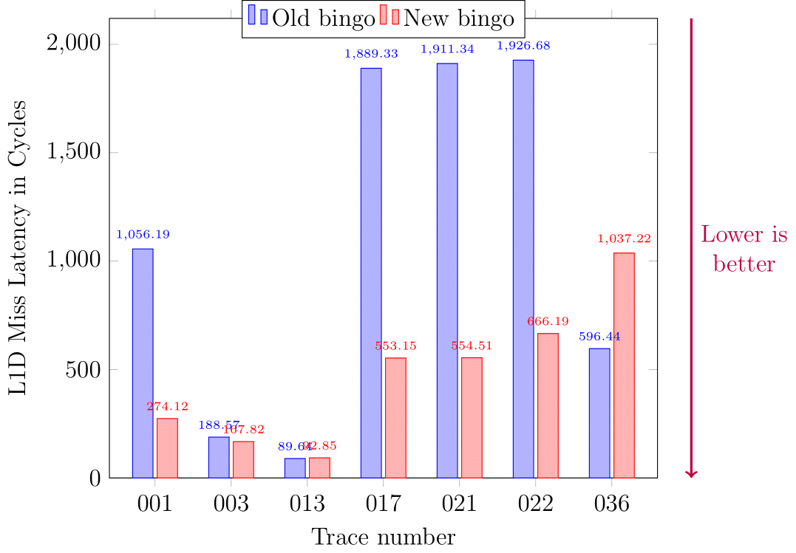

<p align="center">
  <h1 align="center"> Priority Based Bingo </h1>
</p>

# What is it?

Priority Based Bingo is a modification of the Bingo[[1]](#references) prefetcher, built on top of the ChampSim[[2]](#references) simulator, for the CS305 course project at IIT Bombay. More details are below.

P.S. for the contribution breakdown, please see the end of this document.

# What we added

- `prefetcher/bingo_new.l1d_pref` contains our modified version of Bingo, with the priority-decision mechanism.
- `inc/cache.h` and `src/cache.cc` have been modified to implement timeliness measurements, the NACK mechanism and the upgrade mechanism.
- `inc/dram_controller.h` and `src/dram_controller.cc`have been modified to support various mechanisms in DRAM to perform demotion, promotion, NACKing and upgrading.
- `src/main.cc` sees some changes to be directly able to specify bandwidth.
- `run_champsim.sh` has been modified to be able to directly specify bandwidth. For example,

```
./run_champsim.sh bimodal-next_line-bingo-bingo-bingo-lru-1core 10 10 28 server_003.champsimtrace.xz
```

will run the compiled ChampSim binary `bimodal-next_line-bingo-bingo-bingo-lru-1core` on the trace `server_003.champsimtrace.xz` for 10M instructions for warmup and simulation each, with a DRAM bandwidth of 2800 MT/s.

- Since we chose to work with the traces numbered 01, 03, 13, 17, 21, 22 and 36, the `summary/` folder includes the summaries for these traces. The scripts `run.py` and `summarize.py` help with running and summarizing the result, respectively.
- The `plots/` directory contains some relevant plots.

# A little bit about Bingo

Bingo associates _events_ like access to a page with _footprints_ like (PC+Address) and (PC+Offset). Longer events tend to be likelier but are rarer; hence all footprints are important. Bingo uses a clever trick to use the same table to look-up all footprints: it indexes the table with a hash of the smaller one, while using the longer one (which is a superset of the smaller footprint) as the tag.

Bingo tracks information on a page-to-page basis. That is, assuming a pagesize of `P` bytes and a cacheline size of `B` bytes, all pages when first accessed get assigned a bit-vector of `(P/B)` bits, with the set bits denoting the accessed cachelines. Subsequently, when the same page is touched in the future, the bitmap is used to guide the launched prefetches.

# Bingo's behaviour at low bandwidth and root cause

Bingo breaks down at low bandwidth, as do other prefetchers. The root cause of this problem is as thus: at low bandwidth, the egress rate of the DRAM queue is lower, but the ingress rate is not. This leads to queue-buildup, leading to high queueing delays. Prefetchs serve to make this issue worse by occupying queue slots. This is especially an issue for aggressive prefetchers like Bingo. This is corroborated by the variation of IPC with bandwidth:

<p align="middle" float="left">
  
</p>
The LLC miss latencies tell the same story:
<p align="middle" float="left">
  
</p>

# What we set out to do

Our goals were as follows:

- Reduce the miss latency at all levels
- Reduce the number of prefetches to free up bandwidth, but do so while **increasing accuracy**.
- Avoid any IPC drops due to the coverage reduction caused above.
  - For this, we need to ensure that we are not stopping prefetches when the DRAM queue (DQ) is relatively free. The DQ occupancy is sporadic and hence this is important.

# The idea

The key issue here is that Bingo knows which prefetches are likely to be important, while the DRAM controller knows whether the queue is congested. Our task was to bridge the two. To do so, we utilized a priority mechanism to mark prefetches as falling into one of three classes (1-3), and have the DRAM controller deal with each kind separately.

# Choosing the traces

Since Bingo operates at the L1D, and the problem persists at the DRAM controller, the ceiling of any improvement is determined by how many request that reach the controller are actually from the L1D. For instance, consider the plot below:

<p align="middle" float="left">
  
</p>
We observe that traces 001, 013 and 021 have a high percentage of requests to DRAM that are Bingo-initiated prefetches, but the same is not true of 002 and 014.
Following this methodology, we narrowed down the traces 001, 003, 013, 017, 021, 022 and 036 as being ripe for exploration.

# Deciding priorities

We decided to use the last-observed timeliness value of a prefetch to an address to determine priority. We defined three thresholds `THRESH1` through `THRESH3` for this purpose. We compare the last-observed prefetch-to-use delta to these thresholds, and based on the comparison assigned it priorities among 1 (most important), 2 (important but not pressing), 3 (unimportant), and 0 (not prefetched).
We modified bingo to use a hash-map to track these timeliness values along with the page footprints.

# DRAM scheduling changes

The general mechanism of scheduling was as follows:

- Initially all prefetches go to the main queue.
- When the main queue is congested, the following actions are taken:
  - Prefetches with priority 1 are treated just like before.
  - Prefetches with priority 2 are demoted to a lower priority queue.
  - Prefetches with priority 3 are dropped, and a NACK is sent to the LLC to signal this.
- When the queue is not congested, the higher and lower priority queues are operated in a time ratio of 2:1.
- The LLC may request the DRAM to upgrade a request if a demand load was merged with it at the MSHR. In such a case we try to immediately promote it to the main queue. If this fails (for example, if the main queue is full), we add it to a retry list and retry every cycle until success.

# Changes at the caches

The caches see three major changes:

- We equip the code in `cache.cc` to be able to calculate timeliness of prefetches and report it to a prefetcher if it registers a function for the same.
  - One subtlety here is that timeliness (prefetch-to-use delta) can be negative.
- The NACK mechanism is implemented to undo MSHR additions on receiving NACKs.
- The upgrade mechanism is implemented to update priorities of prefetches when they are merged with demand loads.
  - There are some subtleties here as well: for instance a prefetch may have been queued but not yet been added to the MSHR.
  - Further, there were challenges arising from having prefetches from multiple levels which we solved.
- The NACK and upgrade mechanism can interact in unexpected ways which we had to solve. One particular bug in our first implementation was as follows (when we were experimenting with priority 3 prefetches from L2 and LLC):
  - The L2 sends a prefetch down, which passes through the LLC and to the DRAM. This is NACKed. Just before this, the L1 issues a prefetch which now sits in the L2 PQ. Then, due to the NACK, the L1 (and L2/LLC too) erases its MSHR entry. However the L2 PQ request is served, which leads to an assertion failure.

# The results

The miss latency improves dramatically at all levels. At the LLC,

<p align="middle" float="left">
  
</p>
At the L1D:
<p align="middle" float="left">
  
</p>
The accuracy increases significantly:
<p align="middle" float="left">
  
</p>
The IPC does not drop, in accordance with our goals:
<p align="middle" float="left">
  
</p>
The coverage, however, does (not unexpected):
<p align="middle" float="left">
  
</p>
Overall, we think the results look promising.

# Future work: Applicability to other prefetches

The priority mechanism described above is general and may be merged with other proposals as well, for example, with IPCP [[3]](#references). Alternatively, it may be implemented at the caches themselves and be agnostic to the choice of the prefetcher. These approaches are left for future work.

# Authors and Contribution Breakdown

This work was brought to you by Team ARCHimedes. The breakdown is as follows:
| Author Name | Contributions |
| :---: | :---: |
| Vibhav Aggarwal | DRAM scheduling changes, Upgrade mechanism, Slides, Brainstorming |
| Adithya Bhaskar | DRAM scheduling changes, Final result plotting (+scripts), Slides, Brainstorming |
| Devansh Jain | Bandwidth-characterization, Helper scripts, NACK mechanism, Slides, Brainstorming|
| Harshit Gupta | Bingo modifications, Timeliness measurement and passing code, Slides, Brainstorming |
| Harshit Varma | NACK mechanism, Upgrade mechanism, Helper scripts, Slides, Video, Brainstorming |

# References

1.  M. Bakhshalipour, M. Shakerinava, P. Lotfi-Kamran and H. Sarbazi-Azad, "Bingo Spatial Data Prefetcher," _2019 IEEE International Symposium on High Performance Computer Architecture (HPCA)_, 2019, pp. 399-411, doi: 10.1109/HPCA.2019.00053.
2.  "ChampSim", https://github.com/ChampSim/ChampSim
3.  S. Pakalapati and B. Panda, "Bouquet of Instruction Pointers: Instruction Pointer Classifier-based Spatial Hardware Prefetching," 2020 ACM/IEEE 47th Annual International Symposium on Computer Architecture (ISCA), 2020, pp. 118-131, doi: 10.1109/ISCA45697.2020.00021.
